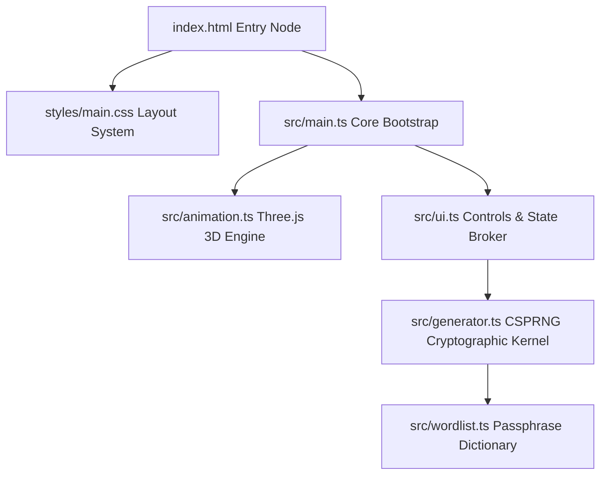

# VaultAura — A Premium, Luxury Minimalist Cryptographic Key & Passcode Generator Layout.

> "Secured in Gold. Forged in Obsidian."
>
> An ultra-high-end, standalone cryptographic generation station blending tactile, high-entropy algorithms with a premium tactile, matte-obsidian luxury brand aesthetic.

---

## 💎 Design Philosophy

VaultAura represents a departure from generic utility design, incorporating elite, tactile UI patterns inspired by luxury automotive consoles and surgical hardware interfaces.

- **Obsidian Core Colorways:** The workspace is built upon pure obsidian-black (#09090b) surfaces, charcoal-brushed backings, and strict hairline divider borders (1px solid #27272a) that create a sense of mechanical density.
- **Champagne Gold Interactive Geometry:** Interactivity is indicated by elegant, glowing brushed gold highlights (#d4af37), responding dynamically to inputs, focus hooks, and slider drags.
- **Spatial Background Layer:** A floating 3D WebGL Canvas powered by Three.js is bound to the document root, housing a segmented, flat-shaded icosahedral crystal mesh that reacts dynamically to control metrics and slider manipulations.

---

## 🛠️ Technical Feature Architecture

| Feature Module | Underlying Algorithm | Security / Telemetry Metrics | User Experience Integration |
| :--- | :--- | :--- | :--- |
| **Alpha-Numeric High-Entropy** | Crypto-grade CSPRNG (`window.crypto.getRandomValues`) | Shannon Entropy computation ($H = L \log_2 N$), keyspace sizing, and GPU-cracking duration indices. | Adjustable key lengths (8–25), subset toggles (A-Z, a-z, 0-9, symbols), and ambiguous character filtering. |
| **Word-Based Passphrases** | Dictionary-indexed CSPRNG selector mapping to a 2,048-word clean list. | Computes overall phrase bits of entropy based on discrete combinatorics. | Custom separators (hyphen, underscore, dot) and casing controls (lowercase, Title Case, UPPERCASE). |
| **Secure PIN Block Arrays** | Random digital byte array generation with localized pattern auditing. | Rejects ascending, descending, or repeating digital patterns. | Configurable digits (4–12), grouped format support, and custom filtering toggles. |
| **Volatile Clipboard Flushing** | Time-decayed local buffer hook. | Auto-deletes copy-buffers from client system clipboard after 30 seconds to block memory dump vectors. | Visual progress bar indicators and luxury success state buttons. |

---

## 🧬 System Architecture & Compilation

The project is built entirely client-side, with zero server dependencies, making it perfectly standalone and optimized for immediate deployment to **GitHub Pages**.



### Development Compilation Commands

1. **Install Dependencies:**
   ```bash
   npm install
   ```
2. **Launch Development Sandbox:**
   ```bash
   npm run dev
   ```
3. **Compile Static Asset Distribution Bundle:**
   ```bash
   npm run build
   ```

---

## 👨‍💻 Developer Core Profile

### **Lead Developer:** Ganesh S.
* **Background:** Electronics and Communication Engineering (ECE) Student, specializing in Internet of Things (IoT), Embedded Systems, and Advanced AI Architectures.
* **Specialized Domain Expertise:** Dynamic WebGL canvas designs, client-side cryptographic systems, and robust DevOps automation.

### **Core Project Portfolio:**
- **🌌 AuraVerify:** An advanced AI-driven Deepfake Voice Detection Framework utilizing spectral analysis and convolutional neural network (CNN) architectures to authenticate auditory signals in real-time.
- **⚡ Cogni-Grid:** An intelligent, decentralized IoT Fault Detection and Mitigation System engineered for rural microgrids to identify anomalies and protect micro-transformers dynamically.
- **☀️ Solar-Sync:** A simulation framework implementing intelligent local load scheduling, balancing renewable solar generation curves with grid loads dynamically.

---

*Secured client-side. Built with Vite, TypeScript, GSAP, and Three.js.*
